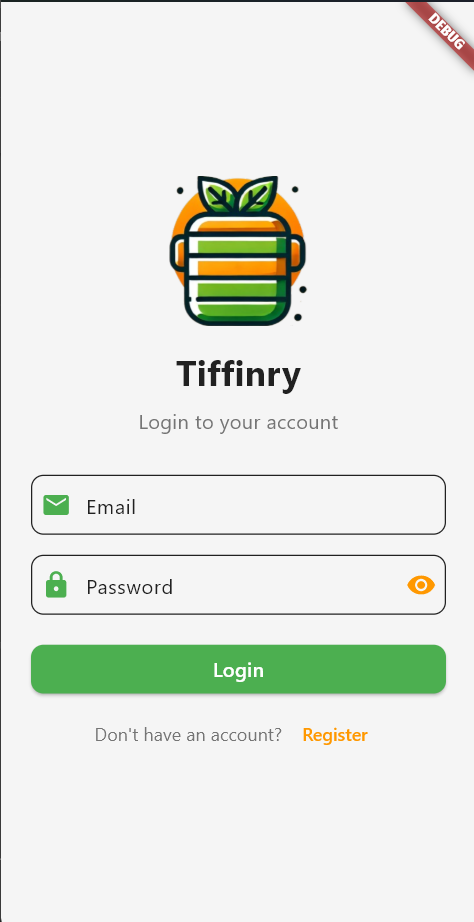
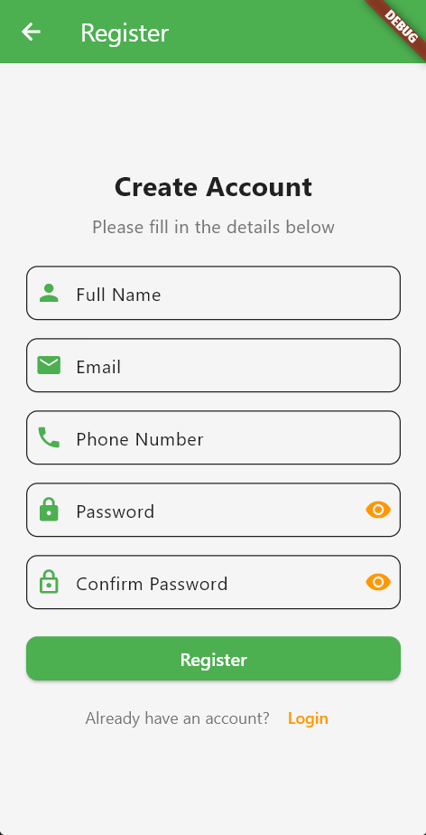
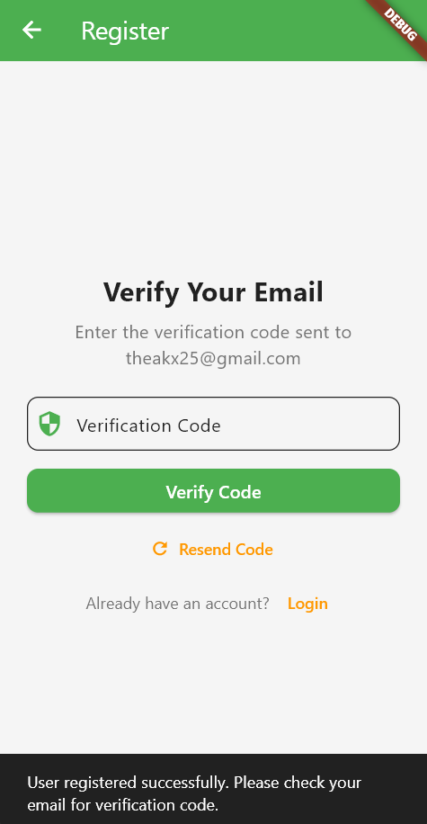
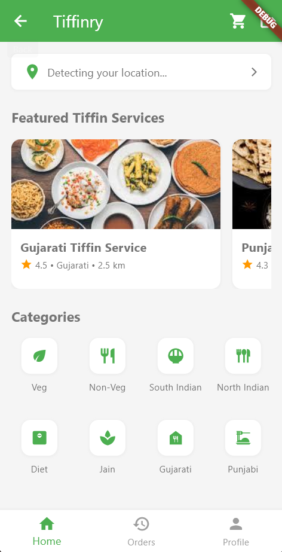
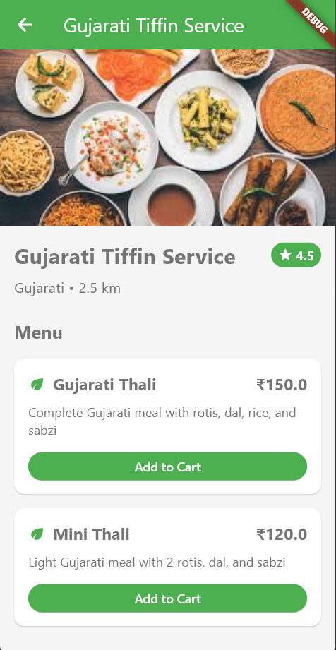
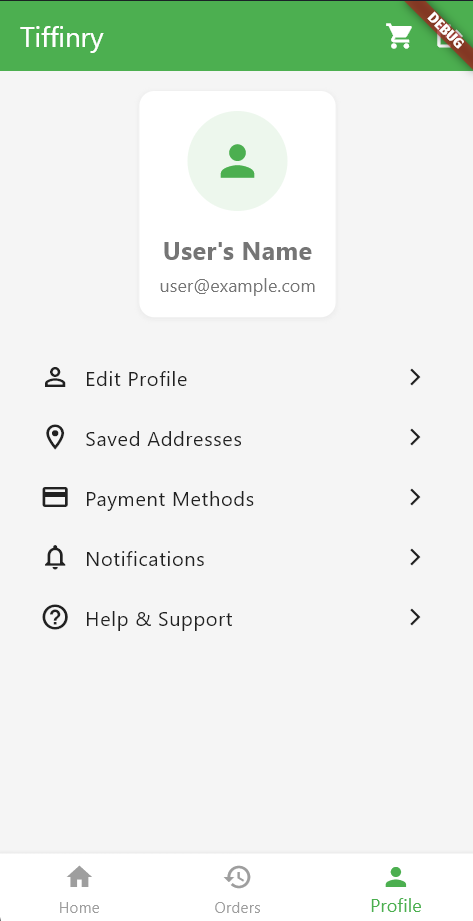
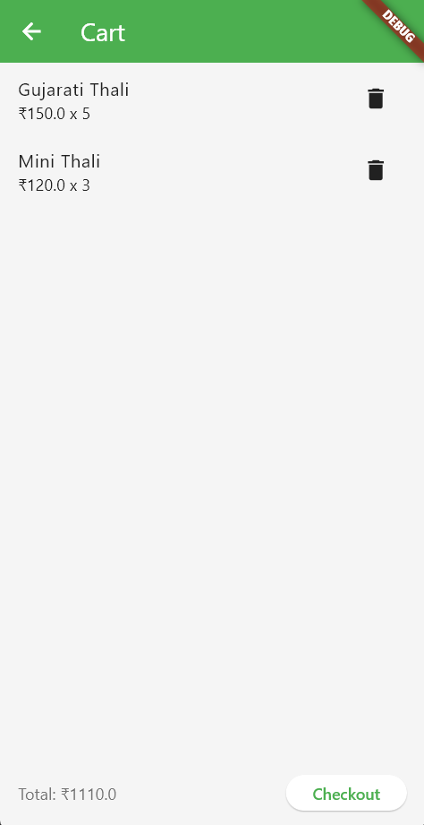
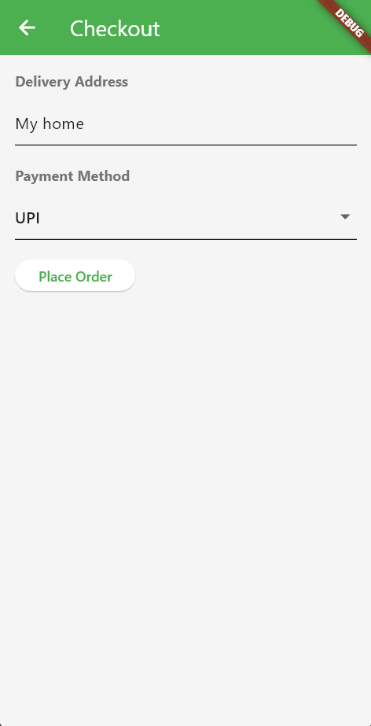
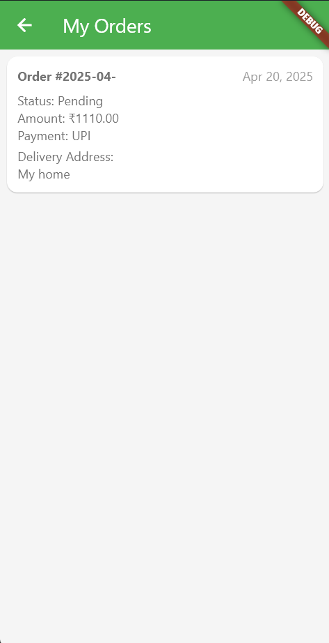

# 🍱 Tiffin Service App - Frontend (Flutter)

This is the **frontend** of the Tiffin Service App, built using **Flutter**. The app connects users with nearby tiffin providers, allows browsing menus, placing orders, and managing profiles, all through a smooth mobile interface.

>  This repo is only for the **Flutter frontend**. The backend (Spring Boot + MySQL) is available in a separate repository.

---

## 📲 Features

-  User Registration & Login
-  Email Verification (requires a code sent via backend)
-  View Nearby Tiffin Services
-  View Tiffin Menus
-  Add to Cart & Checkout
-  Track Orders
-  User Profile & Order History

More features (subscription plans, payments, etc.) are under development.

---

## 🧰 Tech Stack

- **Frontend:** Flutter, Dart
- **Backend:** Spring Boot (separate repo)
- **Database:** MySQL
- **APIs:** RESTful endpoints (connected via HTTP requests)

---

## 🛠️ Getting Started

### 1. Clone the Repository

```bash
git clone https://github.com/akshatkmistry/Tiffin-Service-Frontend.git
cd Tiffin-Service-Frontend
```

### 2. Install Dependencies

```bash
flutter pub get
```

### 3. Run the App

```bash
flutter run
```

Make sure a device (emulator or physical) is connected.

---

## ⚠️ Notes

- Registration uses **email verification**:  
  When registering, a verification code is sent to the user’s email (handled by backend). That code must be entered to complete signup.

- This app is under active development.  
  Stay tuned for:
  - Meal subscription plans
  - Payment gateway integration
  - Location-based service recommendations
  - Enhanced profile settings

---

## 📸 Screenshots

### Login Screen, Register Screen, and Code Verification Screen
<div style="display: flex; flex-wrap: wrap; gap: 10px;">
  
  
  
</div>

### Home Screen, Menu Screen, and Profile Screen
<div style="display: flex; flex-wrap: wrap; gap: 10px;">
  
  
  
</div>

### Cart Screen, Checkout Screen, and Orders Screen
<div style="display: flex; flex-wrap: wrap; gap: 10px;">
  
  
  
</div>

## 🤝 Contributing
🚀 Feel free to fork the repository and submit pull requests! Contributions are welcome.  


## 📧 Contact
For any queries, reach out via **GitHub Issues** or email at:  
✉️ **akshatkmistry007@gmail.com**  

Happy Coding! 🎉

